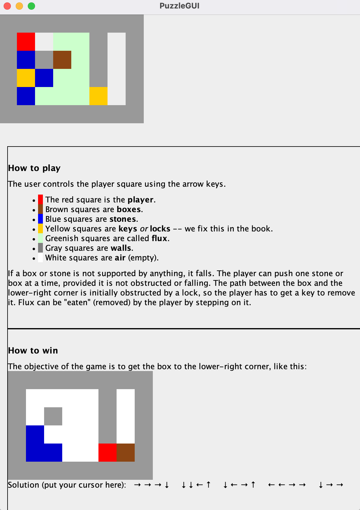

# Five Lines of Code 실습
* [도서 링크](https://m.yes24.com/Goods/Detail/116904325)
* [원본 소스](https://github.com/wikibook/five-lines/blob/main/index.ts)

| **책에서 소개된 규칙 요약**        | **책에서 소개된 리팩터링 패턴 요약** |
|--------------------------|------------------------|
| 다섯 줄 제한                  | 메서드 추출                 |
| 호출 또는 전달, 한 가지만 할 것      | 클래스로 타입 코드 대체          |
| if 문은 함수의 시작에만 배치        | 클래스로의 코드 이관          |
| if 문에서 else 를 사용하지 말 것   | 메서드의 인라인화          |
| switch 를 사용하지 말 것        | 메서드 전문화          |
| 인터페이스에서만 상속받을 것          | 삭제 후 컴파일하기          |
| 순수 조건 사용                 | 유사 클래스 통합          |
| 구현체가 하나뿐인 인터페이스를 만들지 말 것 | if 문 결합          |
| getter 와 setter 를 사용하지 말 것 | 전략 패턴의 도입          |
| 공통 접사를 사용하지 말 것          | 구현에서 인터페이스 추출          |
|                          | getter 와 setter 제거하기          |
|                          | 데이터 캡슐화          |
|                          | 순서 강제화          |

### 작업 0
* index.ts -> Puzzle.java 로 변경 (UI 는 Swing 사용)
